## Overview {.side-image}

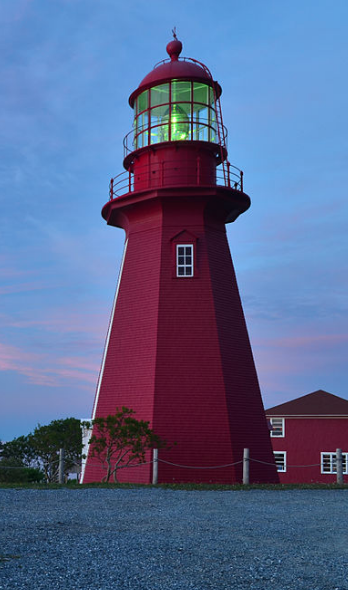

- Overview
- Introduction to Gthnk
- Installation
- Typical Use as a "Work Journal"
- Integration with apps and OS
- Conclusion

# Introduction to Gthnk

## Journal {.side-image}

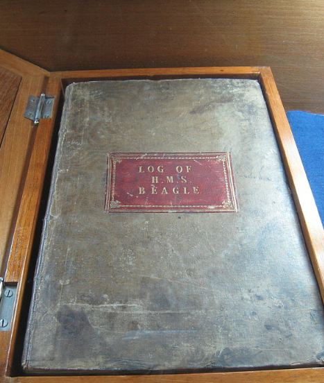

- Logbook
- Lab Notebook
- Work Journal
- Quote book
- Daily Diary
- others?

## Chronology {.side-image}

- time: a line that goes "forward"
- entries are organized by day
- gthnk uses this chronology to organize your notes
    - further organized by hour and minute
    - (seconds are not really regarded)

## What *is* Gthnk? {.side-image}

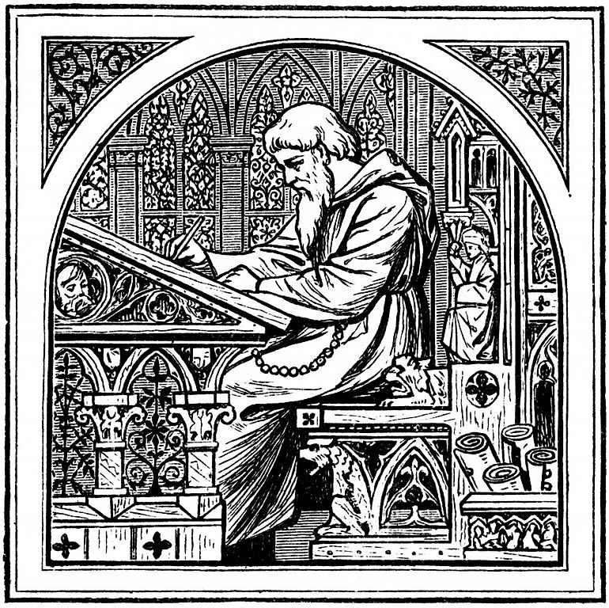

- Gthnk is a database
- always running on your computer
- type your notes into a text file ("journal")
- supports markdown, so links and formatting work
- notes imported into database at midnight
- web browser to search and view notes
- use whatever editor and browser you want

## Related Software {.side-image}

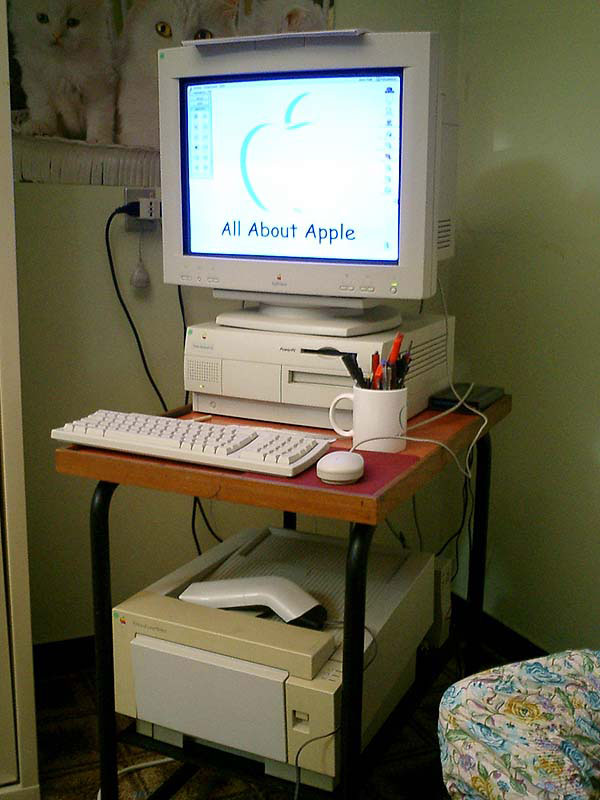

- Microsoft OneNote
- Evernote
- Emacs Org-mode
- Yojimbo
- DevonThink
- Google/Apple Notes

## Archival {.side-image}

- how much has Word .doc changed in 20 years?
- is there a future in digital formats?
- Gthnk's simple text file format can be printed
- printed hardcopy can be scanned and OCRed
- scanned result recreates original Gthnk database
- imagine a 100-year record with archival ink and paper

## Handwritten Notes {.side-image}

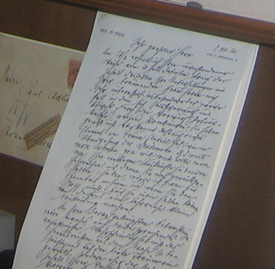

- not all notes are suited to text files
- visual: drawings, schematics, diagrams, charts, graphs
- spontaneous: meetings, lectures, live events
- flexible: collaborative, multi-colors, outdoors
- Gthnk's solution: attach to Chronology
- learn the standardized handwritten page heading
- scan pages as PDF, drag-drop onto Gthnk

## Mobile Notes {.side-image}

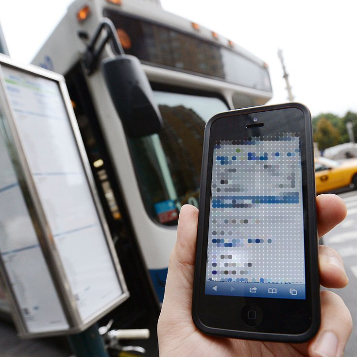

- mobile is so convenient; always with you
- is the cloud secure? are your notes private?
- Gthnk is an offline database that runs on your computer
- Supports mobile text files via cloud drives
    - dropbox
    - google drive
    - etc...
- Gthnk's cloud compromise: global write, local read

## Attachments {.side-image}

- Attach digital media to a Day in Gthnk
    + PDFs, including handwritten notes
    + images: JPEGs, GIFs, PNGs, etc.
- drag-drop media onto drop target
- pages can be re-ordered after importing
- Attachments are stored in database

## Introducing Gthnk {.side-image}

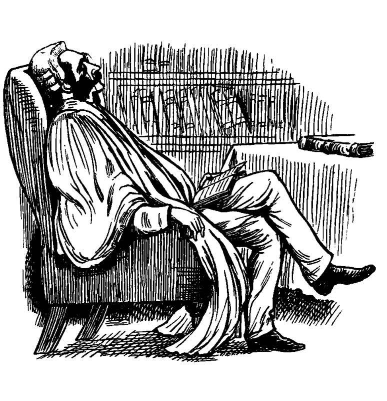

- a personal **Journal**
- supports long-term **Archival**
- technically, it's a **Database**
- a **Chronology** of your notes
- including **Handwritten Notes**
- and **Mobile Notes**
- and image **Attachments**, generally

# Installation

## Online Installation Guide {.side-image}

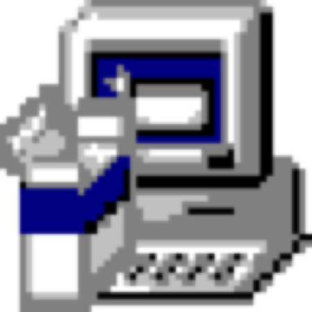

- http://install.gthnk.com
- step-by-step installation process
- overview
    + install Python
    + then install Gthnk
- Windows and OS X
- You will be using Gthnk when complete

# Typical Use

## Keeping a Text Journal {.side-image}

- Use any reasonably-nice text editor
    + Supported: Sublime Text
    + Good: Microsoft VS Code
    + Good: Emacs AND vi
    + Android: Jota+
- Rules of the Journal format:
    + a day token is YYYY-MM-DD
    + an entry token is HHMM
    + tokens have 2 linefeeds before and 2 linefeeds after

## Journal Rotation {.side-image}

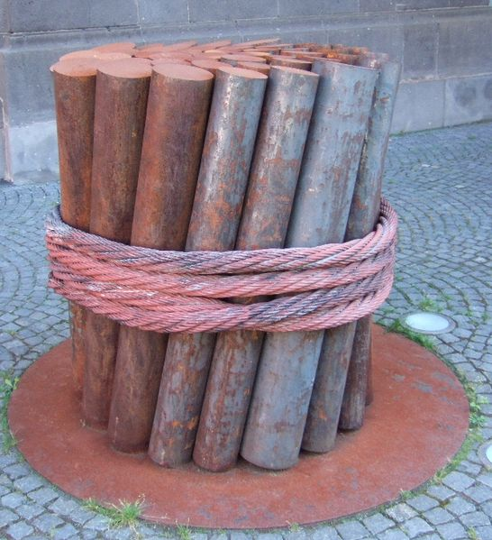

- Each day, Gthnk imports whatever is in your journal.
    + **this is how stuff "gets into Gthnk"**.
- "refresh" button triggers rotation.
- Your journal files are cleared during rotation.
    + you start a new day with the blank file.
    + NB: You need a text editor that "notices" this

## Searching {.side-image}

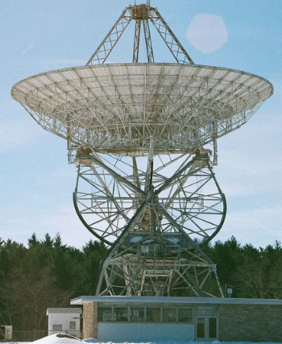

- Landing page provides a search box
- Search button in the UI
- results consists of matching entries
- entries are sorted by date
- clicking brings you to the original day

## Daily Review {.side-image}

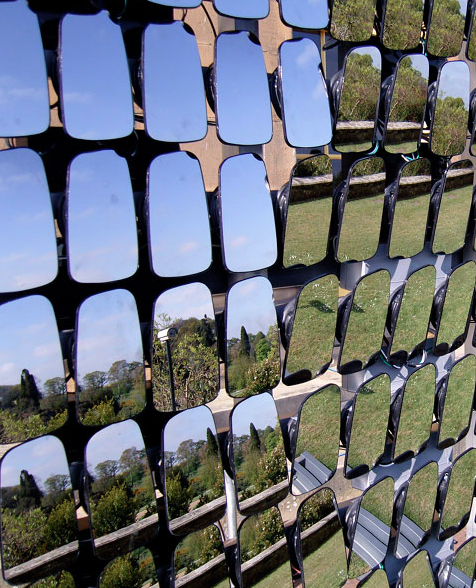

- Each morning at 9am, Gthnk launches with the most recent entries.
    + usually, this is "yesterday"
- It's automatic.
- reviewing the notes is a good daily practice

# Integration with apps and OS

## Gthnk Integrations {.side-image}

- Gthnk is always running
- it is a web service
- there are many clever ways to hook into Gthnk
- integrations make Gthnk much faster

## Web browsers {.side-image}

- load Gthnk with any web browser
- add Gthnk as a search engine
    + Gthnk is a web service
    + search your notes from your browser
- add Gthnk to your Desktop as an "App"
    + works with Chrome on OS X and Windows

## Text editors {.side-image}

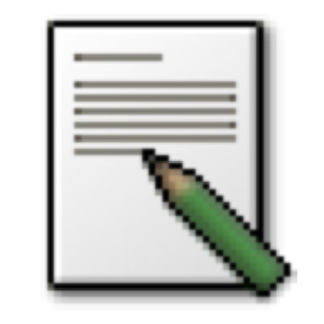

- date and time macros
    + bind a hot key
    + never type these again
- file modification detection
    + editor auto-reloads changed files
    + most text editors have this

## Hot keys and Launchers {.side-image}

- use a key combination to launch Gthnk
    + your notes are a keystroke away
- Launchers
    + OS X: Spark.app
    + Windows: AutoHotkey
    + others

## Mobile files {.side-image}

- Gthnk can import multiple journals during rotation
    + edit the configuration
- Pattern for mobile:
    + Dropbox/journal-phone.txt
    + Dropbox/journal-tablet.txt
- Now edit those files on the road
- Gthnk rotates them

## Summary {.side-image}

- Gthnk provides lots of ways to integrate
- opportunities to mesh with life
- work faster

# Conclusion

## Gthnk {.side-image}

- a personal **Journal**
- supports long-term **Archival**
- technically, it's a **Database**
- a **Chronology** of your notes
- including **Handwritten Notes**
- and **Mobile Notes**
- and image **Attachments**, generally

## Online Resources

- http://www.gthnk.com Website
- http://docs.gthnk.com Documentation
- http://code.gthnk.com Open Source Project
- http://issues.gthnk.com Issue Tracker
- http://python.gthnk.com Python Project
- http://blog.gthnk.com Blog
- http://chat.gthnk.com Chat

## Images in this Presentation {.columns-2 .smaller}

- [Strategy](https://en.wikipedia.org/wiki/File:Strategy.jpg)
- [Light House](https://commons.wikimedia.org/wiki/File:La_Martre_lighthouse_-_La_Martre,_QC,_CA_-_16-06-2013.jpg)
- [Log Book](https://commons.wikimedia.org/wiki/Category:Logbooks#/media/File:HMS_Beagle_log_book.JPG)
- [Basilica](https://commons.wikimedia.org/wiki/File:(La_Bas%C3%ADlica_del_Voto_Nacional,_Quito)_pic._u.JPG)
- [Writing Desk](https://commons.wikimedia.org/wiki/File:Medieval_writing_desk.jpg)
- [Desktop Computer](https://commons.wikimedia.org/wiki/File:PowerMac_g3_233.jpg)
- [Library Stacks](https://commons.wikimedia.org/wiki/File:CityHallTorontoPublicLibrary.JPG)
- [Freud Handwriting](https://commons.wikimedia.org/wiki/File:Freud-Handwriting.jpg)
- [Mobile Phone](https://commons.wikimedia.org/wiki/File:Bus_Time_Manhattan_Launch_(10142555034).jpg)
- [Red Stapler](https://commons.wikimedia.org/wiki/File:Stapler-swingline-red.jpg)
- [Ballads of the Bench and Bar](https://commons.wikimedia.org/wiki/File:Image_taken_from_page_54_of_%27Ballads_of_the_Bench_and_Bar;_or,_Idle_Lays_of_the_Parliament_House._(Edited_by_J._B._Paul_and_J._J._Reid.)%27_(11280025073).jpg)
- [Installer](https://commons.wikimedia.org/wiki/File:InstallJammer-small.png)

This presentation is online at http://overview.gthnk.com

- [Green Light](https://commons.wikimedia.org/wiki/File:2010-12-30_Italy_Milan_trafficlight_green.JPG)
- [Bound Book](https://commons.wikimedia.org/wiki/File:Old_book_bindings.jpg)
- [Rotation](https://commons.wikimedia.org/wiki/File:ROTATION.jpg)
- [Radio Telescope](https://commons.wikimedia.org/wiki/File:Howard_E._Tatel_Radio_Telescope_-_front.jpg)
- [Mirror Array](https://commons.wikimedia.org/wiki/File:Aleph-reorganizing-vision.jpg)
- [Gears](https://commons.wikimedia.org/wiki/File:New_England_Fall_Color_Tour_Oct._2012_187.JPG)
- [Web](https://commons.wikimedia.org/wiki/File:Dew_on_spider_web_Luc_Viatour.jpg)
- [Leafpad](https://commons.wikimedia.org/wiki/File:Leafpad.png)
- [Shuttle Launch](https://commons.wikimedia.org/wiki/File:Space_Shuttle_Columbia_launching.jpg)
- [Cloud Computing](https://commons.wikimedia.org/wiki/File:Cloud_computing_icon.svg)
- [Landscape Laugavegur](https://commons.wikimedia.org/wiki/File:Landscape_during_Laugavegur_hiking_trail_2-CA_reduced.jpg)

## Thank You {.side-image}

- next step: [install.gthnk.com](http://install.gthnk.com)
- Ian Dennis Miller
- **@iandennismiller**
